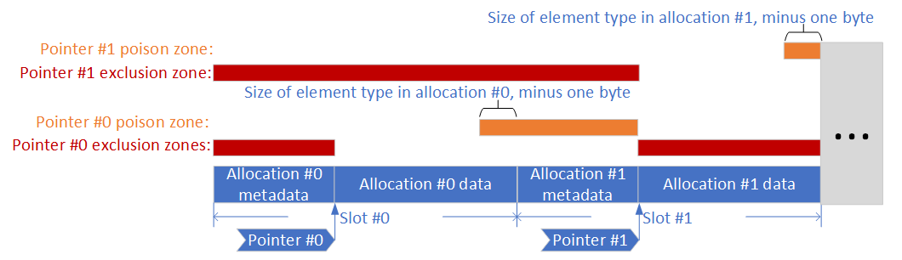

BackupRefPtr Spatial Safety Extension
=====================================

Authors: michael dot lemay at intel dot com

February 2021

== One-page overview

=== Summary

https://docs.google.com/document/d/1m0c63vXXLyGtIGBi9v6YFANum7-IRC3-dmiYBCWqkMk/view[BackupRefPtr]
seeks to deterministically enforce temporal memory safety. This document
describes an extension to BackupRefPtr to also deterministically enforce
spatial memory safety (e.g. to mitigate buffer overflows) without
storing any additional metadata. We refer to the extension herein as
_BackupRefPtrSpatial_. It operates by checking that the pointer stays
within valid bounds any time the pointer is updated.

=== Platforms

Mac, Windows, Linux, Chrome OS, Android, Android WebView, iOS.

=== Team

michael dot lemay at intel dot com

=== Bug

Pending.

=== Code affected

Base.

== Design

=== Background

BackupRefPtrSpatial builds on
https://docs.google.com/document/d/1m0c63vXXLyGtIGBi9v6YFANum7-IRC3-dmiYBCWqkMk/view[BackupRefPtr],
so we provide brief background on BackupRefPtr here. BackupRefPtr seeks
to deterministically mitigate temporal safety violations for allocations
managed by PartitionAlloc. It operates by maintaining a reference count
for each such allocation and only permitting memory to be assigned to a
new allocation after all references to the previous allocation have been
dropped. When an allocation is freed while references to it are still
outstanding, the memory for the allocation is overwritten with a poison
pattern that is likely to cause a crash if used.

BackupRefPtr is one of multiple possible policy enforcement
implementations backing an overall CheckedPtr template. Chromium
includes a tool based on LLVM Clang to automatically rewrite a
configurable subset of the C++ source code for Chromium to use
CheckedPtr instances instead of raw pointers.

PartitionAlloc groups each set of similarly-sized allocations into a
region of memory with identical slot sizes throughout the entire region.
The reference count metadata for each allocation is stored at the beginning
or end of the slot for the allocation. PartitionAlloc can locate the metadata for
an allocation given a pointer with any offset within the allocation
without requiring any locator metadata to be embedded within the
pointer, since it can trivially compute all slot boundaries within each
memory region.

=== Overview

BackupRefPtrSpatial operates by strictly excluding pointers from certain
regions of memory and poisoning them whenever they point to certain
other regions such that an attempt to dereference a poisoned pointer
causes the browser to immediately crash. These regions are illustrated
below:

If cookies are disabled, then the exclusion zone preceding an allocation
ends at the beginning of the usable space for the allocation and the
exclusion zone following a slot begins one byte past the end of the
usable space for the allocation.

This is an illustration of the configuration that places reference counts
after allocations, but analogous zones can be defined when reference
counts are stored before allocations. In that configuration,
the reference count is entirely within the exclusion zone for its
containing slot and only its first byte is within the poison zone
for the preceding slot (assuming no cookies). The remainder of the
reference count is in the exclusion zone for the preceding slot.

The reason that exclusion zones alone do not suffice such that we also
need poison zones is that pointers sometimes legitimately range
temporarily beyond the point at which an access can be safely performed
through the pointer. For example, when a loop is used to iterate through
an array by updating a pointer into the array during each iteration, the
pointer value following the final iteration may be to the address just
past the end of the array. This is not a memory safety violation as long
as that out-of-bounds pointer is not dereferenced. By poisoning
pointers, BackupRefPtrSpatial maintains compatibility with such software
idioms while also enforcing memory safety by detecting and blocking any
attempt to dereference an out-of-bounds (poisoned) pointer.

Pointers are permitted to point one byte beyond the usable space of the
allocation for compatibility with iterative algorithms that generate
such pointers. However, since the pointers would be poisoned while they
are in that state, dereferences would be blocked.

We defined the new name BackupRefPtrSpatial for this mechanism as a
notational convenience, but it is actually implemented as a set of
inline extensions to BackupRefPtr. It also includes some minor
extensions to PartitionAlloc.

BackupRefPtrSpatial can be enabled by setting the build argument
`backup_ref_ptr_check_spatial = true`.

=== Pointer poisoning

BackupRefPtrSpatial poisons pointers by setting a non-address bit that
is required by the processor to be set to zero for the access to
succeed. The particular bit position that is suitable for this purpose
may vary across architectures and enabled feature sets. For example, bit
63 is suitable for this purpose on x86-64. We refer to this bit as the
“OOB bit.”

By poisoning pointers, BackupRefPtrSpatial avoids the need to instrument
dereference operations. An attempt to dereference the poisoned pointer
will lead to an exception being generated.

Note that pointer poisoning is a completely distinct concept from the
data poisoning that BackupRefPtr employs to induce crashes upon use of
data from freed allocations.

=== Bounds checks

To check pointer updates and detect when a pointer enters its exclusion
zone, BackupRefPtrSpatial first subtracts the size of per-slot prefix metadata
from the original pointer to generate a value that we refer to hereafter
as the “shifted pointer.” BackupRefPtrSpatial then looks up the slot in
which the shifted pointer lands. Each pointer is restricted at each step
to range from the beginning of its referent’s data region to one byte past
the end of its usable space. By subtracting the size of
the prefix metadata prior to mapping the shifted pointer to its slot
BackupRefPtrSpatial can identify the slot for that pointer’s authorized
referent, even when the pointer points into the prefix metadata for the next
allocation. The detection of when the exclusion zone is entered is
implemented first by checking whether the remaining space beyond the updated,
shifted pointer within its slot is too small and next by checking whether the
shifted pointer plus the addend crosses either the lower or the upper slot
boundary.

Next, BackupRefPtrSpatial detects whether the updated pointer lands in
the poison zone, and it updates the OOB bit in the pointer accordingly.

=== Upcasts

BackupRefPtrSpatial does not perform any additional checks or update the
OOB bit in the pointer during upcasts. A valid upcast will not introduce
a new spatial safety violation.

Performing spatial checks during upcasts could incidentally detect violations
that would not otherwise be detected, _e.g._ due to CheckedPtr being initialized
using a pointer that did not satisfy the rules of BackupRefPtrSpatial even at
the time it was initialized. To cover such cases, it would be more direct and
comprehensive to add checks during initialization. This is discussed more in
<<Coverage>>.

=== Pointer comparisons

BackupRefPtrSpatial does not affect the results of pointer comparisons,
because it unconditionally strips the OOB bit from pointers when
generating copies of pointers for comparison purposes.

=== Pointer duplication

Poisoned pointers are not permitted to be duplicated. That could be
supported, but it does not appear to be necessary in Chrome according
to preliminary tests. However, the check for the OOB bit during
duplication may add overhead, and simply propagating the OOB bit to
the duplicate could potentially induce less overhead.

=== Pointer extraction

When extracting the pointer value from the `CheckedPtr` template,
which may be for the purpose of generating an endpoint for an
iterative algorithm, the OOB bit is removed.

=== Extending to check types

BackupRefPtrSpatial does not currently check data types directly,
although BackupRefPtr does already perform checks on the validity of
upcasts. Type confusions that would lead to accesses outside the bounds
of a slot following pointer arithmetic would be detected indirectly as a
result of the bounds checks. A straightforward extension to detect
additional potential type confusions would be to check whether a pointer
is in the poison zone of the slot based on the size of the type
specified when constructing a CheckedPtr.

More precise type safety checks could be implemented by extending the
per-slot metadata to include a type identifier. BackupRefPtrSpatial
could then check that the statically declared type for a CheckedPtr
being created from a raw pointer matches the type specified in the
metadata for the referenced allocation slot or is a valid upcast from
the type specified in the metadata. This is actually orthogonal to
BackupRefPtrSpatial, so it could be implemented separately on top of the
base BackupRefPtr.

=== Extending to 32-bit pointers

It is not feasible to poison 32-bit pointers in a similarly general way
as 64-bit pointers, since all pointer bits are needed for representing
addresses. However, BackupRefPtrSpatial could be extended to poison some
32-bit pointers, specifically those that reference types with elements
larger than one byte. Since PartitionAlloc imposes at
https://chromium.googlesource.com/chromium/src/+/master/base/allocator/partition_allocator/PartitionAlloc.md#alignment[least
an eight-byte alignment], odd pointers to such allocations can be
considered invalid. Thus, BackupRefPtrSpatial can set the
least-significant bit in a pointer to poison it and check for that
poison bit in GetForDereference. Pointers referencing types with
single-byte elements can be skipped by the rewriter.

To extend this further to even cover types with single-byte elements,
GetForDereference just for those types can perform dynamic checks of the
sort that are performed during pointer updates for all types.

=== Extending to enforce spatial safety for *Scan and C code

The spatial safety mechanism described in this document can potentially
be adapted to complement the *Scan approaches for enforcing temporal
safety in Chromium. This can be accomplished by a compiler pass
injecting equivalent logic to that performed by the CheckedPtr template
at the relevant points in the program, specifically at pointer updates.
For 32-bit code, pointer dereferences would also need to be
instrumented. Similar rules as those observed by the CheckedPtr rewriter
regarding which code to instrument would need to be implemented for the
compiler-based instrumentation pass.

This compiler pass-based approach to injecting instrumentation would
also have the benefit of extending enforcement to C code. This could
even inject BackupRefPtr-based temporal safety checks for C code.

=== Defining poison zones even if no metadata is stored in slots

Even if no metadata is stored prior to each allocation, a poison zone
can still be defined such that pointers authorized to access the
preceding slot can temporarily range into that poison zone as long as
they are not dereferenced while pointing into it. The poison zone can
cover a range at the beginning of each slot or extend through the entire
slot, plus the range at the end of the preceding slot that is one byte
smaller than the element type for the allocation. However, it would be
necessary to avoid ambiguity about whether a poisoned pointer is within
or beyond its authorized slot. For example, the poison zone at the
beginning of each slot could be sized to not overlap with the poison
zone at the end of each slot.

=== Coverage

To reiterate, BackupRefPtrSpatial only performs spatial safety checks
during pointer arithmetic. Thus, even if a particular CheckedPtr value
would have been poisoned if generated using CheckedPtr arithmetic, it
will not be poisoned if the CheckedPtr is initialized with that value
directly. If this is deemed a significant limitation,
BackupRefPtrSpatial can be extended to perform similar checks during
initialization to those performed during pointer arithmetic, as noted
above. This may require assuming that the pointer initially points
somewhere within its authorized slot to avoid ambiguity. To be more
specific about that ambiguity, if the pointer points to metadata, it
could be interpreted either as a poisoned pointer authorized to
reference the preceding slot or an underflowed pointer in the exclusion
zone for the current slot.

Array indexing is not currently checked. Implementing `operator[]`
is unsupported when the type of the referent is `void`, etc. One
option for overcoming this limitation would be to define separate
variants of the `CheckedPtr` template, one for types that can be
indexed and the other for the remaining types. The rewriter could
select the appropriate variant in each case. Alternatively, compiler
pass-based instrumentation that does not depend on C++ templates
would not exhibit this limitation.

BackupRefPtrSpatial depends on the same source code rewriting that is
performed for BackupRefPtr, so it inherits the
https://docs.google.com/document/d/1HbtenxB_LyxNOFj52Ph9A6Wzb17PhXX2NGlsCZDCfL4/view[limitations]
on what code is instrumented by that tool.

Some notable limitations include the following:

[arabic]
. The “this” pointer within member functions is required by C++ to be a
raw pointer. However, if that pointer was extracted from a CheckedPtr
that is poisoned, then attempts to dereference it will fault.
. Any allocations outside PartitionAlloc (e.g. globals, stack
allocations, direct-mapped allocations, etc.) are unprotected.
Alternative solutions that do not depend on the PartitionAlloc memory
layout of contiguous regions containing identically-sized slots may be
complementary to BackupRefPtrSpatial for protecting such allocations.
